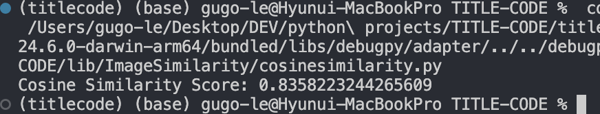
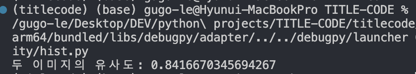

# TITLE-CODE (::) 
<table>
  <tr>
    <td></td>
    <td></td>
    <td></td>
  </tr>
</table>

## Overview :: <br><Br> 미래 사회 100년을 리드하라.

인공지능이 이 시대의 핵폭탄의 비유될 정도로 위력이 날로 커지고 있는 가운데, 인공지능에 대한 비판적, 성찰적 이해, 나아가 인공지능 시대에도 여전히 유효할 인간의 쓸모, 고유한 능력은 무엇인가에 대한 관심이 뜨겁다.

> '인공지능 리터러시' 부상

Chat GPT와 같은 대화서비스와 다양한 플랫폼 서비스가 연계되어 이용자들은 검색, 쇼핑, 예약까지 자동화된 서비스를 이용할 수 있다. 또한 메신저, 메일 등 여러 경로로 오는 업무 지시를 인공지능이 자동으로 감지해 통합하고 실행 계획을 세울 수 있게 해, 업무 생산성에도 큰 영향을 줄 것으로 보인다.

인공지능은 개인의 삶은 물론, 인류 전체에 심대한 영향을 끼칠 전망이다. 인류에 기회 못지 않게 절멸의 위협을 던진 원자력의 경로를 피하기 위해서는 인공지능에 대한 비판적, 성찰적 이해와 대응, 즉 '인공지능 리터러시'가 절실하다. 미국의 인공지능 전문가 랜스 엘리엇 박사는 이런 얘기를 했다.
"그 파도는 위험하며, 우리는 아직 수영하는 법을 모른다"는 것을 인식하는 것, 즉 '건강한 회의주의'가 필요하다고 말한 바 있다.

인공지능 리터러시는 기술에 대한 이해를 넘어 인공지능으로 변화할 세상에 대한 이해로까지 확장되고 있다. 그 질문의 궁극은 결국 인공지능 시대를 버텨탤 인간의 고유하고 본질적인 역량은 무엇인가로 모인다.

>유한자원인 '주의력' 더 소중

누구나 시공간 제약없이 연결된 스마트폰을 통해 인공지능이 제공하는 촘촘한 맞춤형 서비스를 이용할 수 있게 되지만 많은 경우 사용자는 인식조차 하지 못한다. 인공지능이 스스로 알아서 중요한 결정을 내리거나 중요한 조처를 하기 때문인데, 자율주행차에서부터 드론과 무인함정 등과 같이 스스로 전투를 수행할 수 있는 자율무기가 대표적 사례다. 일상에서도 이용자들의 성향을 파악하고 알고리즘을 통해 맞춤화 서비스를 추천하는 방식으로 인간의 선택에 영향을 주고 있다.

이처럼 자동화된 선택 속에 길들면서 ‘우리는 원하는 것을 하고 있는가’라는 근본적인 질문에 봉착하게 된다. 구글 출신 기술윤리학자 제임스 윌리엄스는 저서 ‘나의 빛을 가리지 말라’에서 선택을 돕는 기술이 우리의 주의를 가리는 역설을 꼬집는다. “주의력은 인간 삶의 모든 단계에서 우리의 목표 가치를 설정하고 지향하게 해주는 ‘우리가 원하는 것을 원하도록 해주는’ 근본 역량”인데, 이것이 심각하게 손상되면서 숙고·자기통제와 같이 인간다움을 유지하는 역량도 위축되고 있다고 말한다.

인공지능의 위험성을 경고한 바 있는 유발 하라리도 “인공지능 시대에는 주의력이야말로 우리 삶에서 유한하고 소중한 자원이기에, 외부로 뺏긴 주의력을 우리에게로 가져와야 한다”면서 “내가 누구인지, 내가 인생에서 바라는 게 무엇인지 아는 것”이 인공지능 시대 인간에게 요구되는 핵심 능력이라고 말했다.

>자신의 한계 깨닫는 '메타인지'

인공지능은 지적 능력에서 이미 인간을 능가하면서 일자리도 위협하고 있다. 지식 및 정보의 양과 속도를 따라잡기 어려워지는 상황에서 이에 대응하는 인간의 능력으로 많은 전문가들은 좋은 질문을 하는 능력을 꼽아왔다.

좋은 질문은 자신이 아는 것과 모르는 것을 알아채는 능력, 즉, 자신의 한계를 아는 것에서 출발한다. 급속한 변화 속에서는 새로운 지식이 쏟아지고 지금까지 효율적이었던 지식은 쓸모 없어지기 때문에 결국 자신의 무지를 알고 질문을 하는 능력이 부각된다는 것이다. 자신의 무지와 한계를 아는 것, 즉 메타인지가 인공지능 시대를 버텨낼 인간의 고유한 역량으로 주목받는 까닭이다. 인공지능과 디지털 기술의 발달로 정보와 자극이 넘쳐나는 환경에서 오히려 첨단 지식보다 각자의 내면으로 눈을 돌려 인간 고유의 성찰 능력을 어디에 할당하고 있는지를 돌아봐야 할 필요성이 커지고 있다.

##
```
즉, 정보를 얻기 위해서는 책을 보며 공부하는 것이 아닌 원하는 정보를 얻기 위해서 우리가 어떤 식으로 질문하는지가 중요 ==> 생성된 추상화된 이미지를 띄우고 사용자는 생성된 이미지와 비슷하게 출력하기 위해서 텍스트를 써야함.
```

# Steps
1. Stable Diffusion을 사용하여 초기 추상 이미지를 생성한다.
2. 사용자가 추상 이미지와 비슷한 텍스트를 작성한다.
3. 텍스트 설명을 바탕으로 이미지를 생성한다.
4. 두 이미지를 비교하여 유사도를 계산한다.

## 이미지 유사도 비교

1. 코사인 유사도

```python
import numpy as np
from PIL import Image

def mini_img(img_path, resize_shape=(10, 10)):
    img = Image.open(img_path)
    img = img.resize(resize_shape)
    return img

def cosine_similarity(img1, img2):
    array1 = np.array(img1)
    array2 = np.array(img2)
    assert array1.shape == array2.shape
    
    h, w, c = array1.shape
    len_vec = h * w * c
    vector_1 = array1.reshape(len_vec,) / 255.0
    vector_2 = array2.reshape(len_vec,) / 255.0

    cosine_similarity = np.dot(vector_1, vector_2) / (np.linalg.norm(vector_1) * np.linalg.norm(vector_2))
    return cosine_similarity

img1_path = "./assets/imgs/chat.jpg"
img2_path = "./assets/imgs/gpt.jpg"

img1 = mini_img(img1_path)
img2 = mini_img(img2_path)

score = cosine_similarity(img1, img2)
print("Cosine Similarity Score:", score)

```



>이미지의 코사인 유사도 값이 0.8358~정도 되는 것을 알 수 있다.

- 이미지 크기를 10 * 10으로 Resizing한다.
- 255로 나누어 값을 0~1 사이로 정규화한다.
- 10 * 10 * 3의 3차원 이미지를 (300, )의 벡터로 변환한다.
- 코사인 유사도를 구한다.


2. 히스토그램 기반 유사도

```python
import cv2
import numpy as np

def compare_images(image1_path, image2_path):
    # 이미지 불러오기
    image1 = cv2.imread(image1_path)
    image2 = cv2.imread(image2_path)

    # 이미지 크기 조정
    image1 = cv2.resize(image1, (300, 300))
    image2 = cv2.resize(image2, (300, 300))

    # 이미지를 그레이스케일로 변환
    image1_gray = cv2.cvtColor(image1, cv2.COLOR_BGR2GRAY)
    image2_gray = cv2.cvtColor(image2, cv2.COLOR_BGR2GRAY)

    # 히스토그램 계산
    hist1 = cv2.calcHist([image1_gray], [0], None, [256], [0, 256])
    hist2 = cv2.calcHist([image2_gray], [0], None, [256], [0, 256])

    # 히스토그램 비교
    similarity = cv2.compareHist(hist1, hist2, cv2.HISTCMP_CORREL)

    return similarity

image1_path = './assets/imgs/chat.jpg'
image2_path = './assets/imgs/gpt.jpg'

similarity_score = compare_images(image1_path, image2_path)
print(f"두 이미지의 유사도: {similarity_score}")
```


>이미지의 히스토그램 유사도 값이 0.8416~정도 되는 것을 알 수 있다.


## How to Use
```
pip install gradio torch transformers diffusers
```
